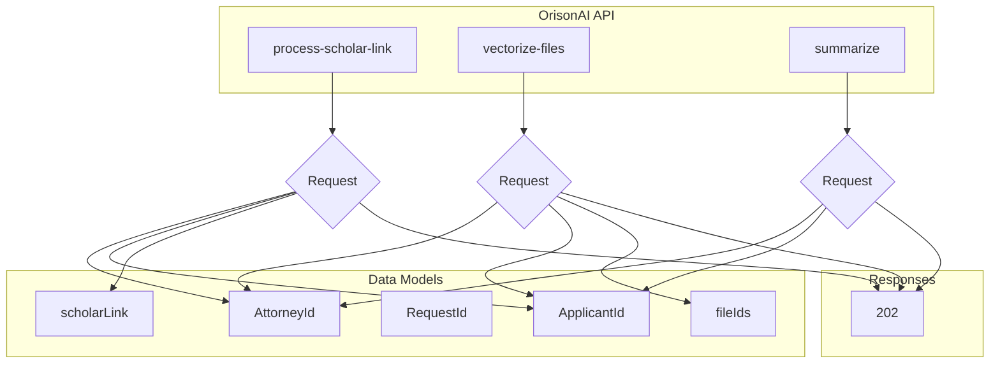

```mermaid
graph TD
    subgraph OrisonAI API
        A[process-scholar-link]
        B[vectorize-files]
        C[summarize]
    end

    subgraph Data Models
        D[AttorneyId]
        E[ApplicantId]
        F[RequestId]
        G[scholarLink]
        H[fileIds]
    end

    A --> I{Request}
    I --> D
    I --> E
    I --> G

    B --> J{Request}
    J --> D
    J --> E
    J --> H

    C --> K{Request}
    K --> D
    K --> E

    subgraph Responses
        L[202]
    end

    I --> L
    J --> L
    K --> L

```