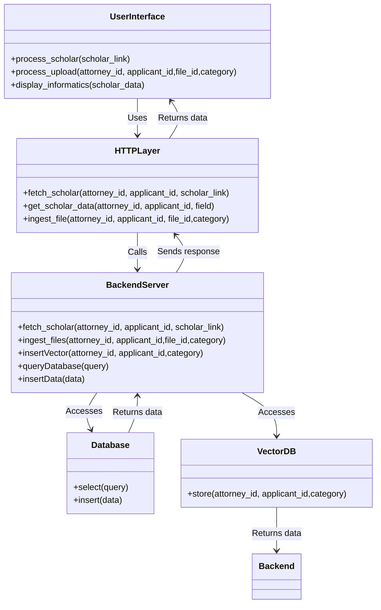

```mermaid
classDiagram
class UserInterface {
        +process_scholar(scholar_link)
        +process_upload(attorney_id, applicant_id,file_id,category)
        +display_informatics(scholar_data)
    }

class HTTPLayer {
        +fetch_scholar(attorney_id, applicant_id, scholar_link)
        +get_scholar_data(attorney_id, applicant_id, field)
        +ingest_file(attorney_id, applicant_id, file_id,category)
    }

class BackendServer {
        +fetch_scholar(attorney_id, applicant_id, scholar_link)
        +ingest_files(attorney_id, applicant_id,file_id,category)
        +insertVector(attorney_id, applicant_id,category)
        +queryDatabase(query)
        +insertData(data)
    }

class Database {
        +select(query)
        +insert(data)
    }

class VectorDB {
    +store(attorney_id, applicant_id,category)
}

UserInterface-- > HTTPLayer: Uses
HTTPLayer-- > BackendServer: Calls
BackendServer-- > Database: Accesses
BackendServer-- > VectorDB: Accesses
Database --> BackendServer: Returns data
BackendServer --> HTTPLayer: Sends response
HTTPLayer --> UserInterface: Returns data
VectorDB --> Backend: Returns data
```